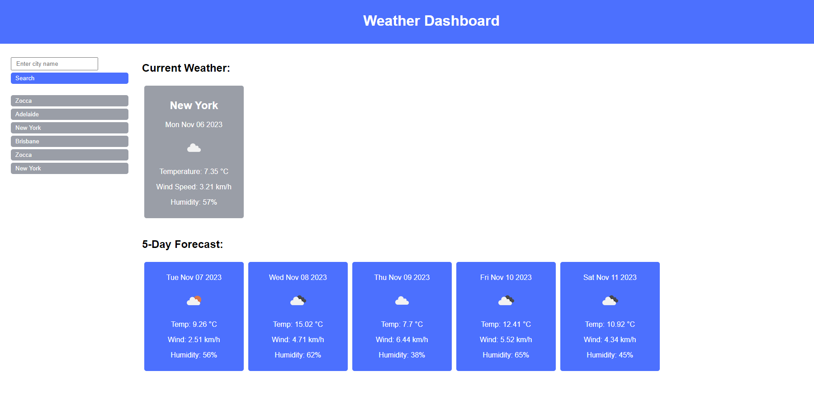
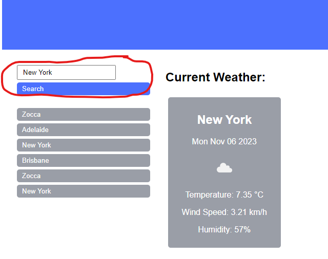
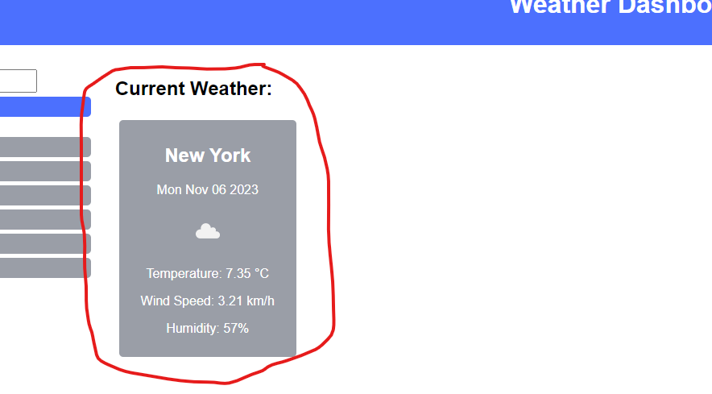
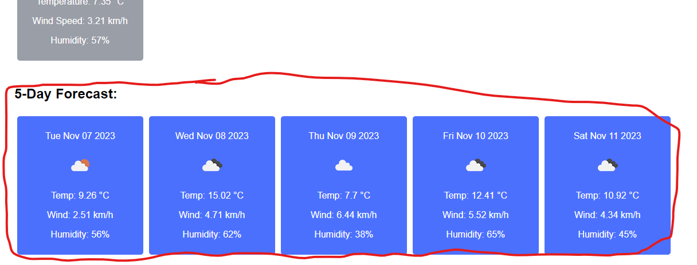
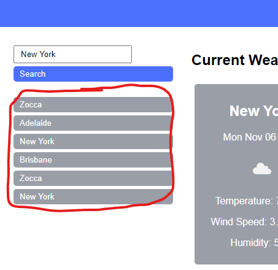

# varnas-weather-dashboard

This Weather App is a simple, user-friendly web application that allows users to search for current weather conditions and forecasts for any city around the globe.



## Features

- Search for weather by city name.



- View current weather conditions, including temperature, humidity, wind speed, and a weather icon.



- See a 5-day weather forecast with similar details.



- Search history: Clickable buttons of previously searched cities for quick access.



- Responsive design for both desktop and mobile devices.

## Setup

To run this project locally, you'll need to have a basic environment with HTML, CSS, and JavaScript support.

### Clone

Clone the repository to your local machine using `https://github.com/KobayashiKerfuffle/varnas-weather-dashboard.git`.

### API Key

The application requires an API key to fetch weather data from the OpenWeatherMap API. You need to sign up on [OpenWeatherMap](https://openweathermap.org/api) to get your API key.

Once you have your API key, replace the `apiKey` variable's value in the `script.js` file with your personal API key.

## Running the Application

Open the index.html file in your web browser to launch the application.

## Usage

```
Type the name of the city in the search input field.
Click on the 'Search' button or press Enter to initiate the search.
View the current weather and the 5-day forecast on the screen.
For past searches, click on the city buttons that appear below the search bar to quickly view the weather again.
```

## Contributions

Contributions are what make the open-source community such an amazing place to learn, inspire, and create. Any contributions you make are greatly appreciated.

If you have a suggestion that would make this better, please fork the repo and create a pull request. You can also simply open an issue with the tag "enhancement".

Don't forget to give the project a star! Thanks again!

```
Fork the Project
Create your Feature Branch (git checkout -b feature/AmazingFeature)
Commit your Changes (git commit -m 'Add some AmazingFeature')
Push to the Branch (git push origin feature/AmazingFeature)
Open a Pull Request
```

## License

Distributed under the MIT License. 

## Contact

Repo Link: https://github.com/KobayashiKerfuffle/varnas-weather-dashboard.git

Pages Link: https://kobayashikerfuffle.github.io/varnas-weather-dashboard